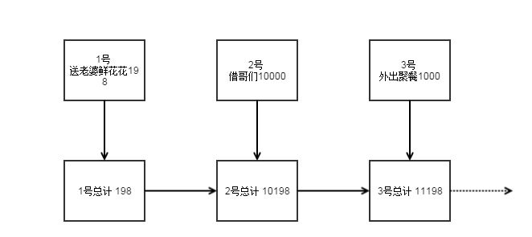

# Checkpoint 介绍

spark streaming作为spark的流式计算扩展，一样具有RDD容错恢复机制。但是由于流式计算的特点，数据是无限流进来的，但是RDD容错机制会根据依赖重新计算丢失的RDD，如果依赖链太长，无疑是个噩梦。

举个例子，我们建立一个spark streaming应用用作老婆统计老公总共的花销，老公每次花销都会通知这个spark streaming应用。比如：



假如某一天，这个数据存储出现了问题，比如“女儿拆了硬盘”（这是不能的！），RDD数据丢失了，当然你说spark的容错机制很强大，2号丢了，从1号开始重新计算出2号就行了。

但是假如这个应用稳定运行了20年了呢，突然昨天的RDD丢失了，我不是要从20年前从头计算？这是多么可怕的噩梦啊。

所以Checkpoint技术就是spark streaming中解决上述噩梦的常用技术。

使用很简单,只需在容错、可靠的文件系统（HDFS、s3等）中设置一个目录用于保存checkpoint信息即可：

```Scala
val ssc = new StreamingContext(...)   // new context
val lines = ssc.socketTextStream(...) // create DStreams
    ...
ssc.checkpoint(checkpointDirectory)   // set checkpoint directory
```

当出现故障恢复时,spark streaming就会直接利用保存下来的checkpoint数据了.

可以通过dstream.checkpoint来设置checkpoint的间隔时间.

但是checkpoint有存储成本,我们不可能吧每个rdd都存下来,也不可能将间隔时间设的很长,所以checkpoint需要好好权衡.推荐来说,checkpoint的间隔时间最好为Dstream的间隔时间的5-10倍大小.