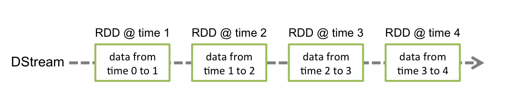
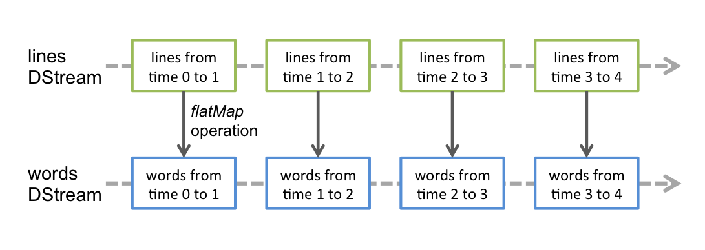

# 离散流介绍

spark streaming 中的离散流实际是连续的按时间段划分的RDD流,英文叫DStreams.如下图:



离散流的操作函数和spark的在形式上是一样的,在内部处理的时候,离散流会将所有的操作分别应用到流中的每一个RDD,比如官方的这幅图:



**Window**

spark streaming 中的Window 概念可理解为按一定时间长度将流多个RDD当作一个具有多个RDD数据的大RDD做处理的结果.如下图


一般来说操作函数名带有window单词的基本都是有窗口操作的.比如:

|Transformation|	Meaning|
| -- | -- |
|window(windowLength, slideInterval)	|基于源DStream产生的窗口化的批数据计算一个新的DStream|
|countByWindow(windowLength, slideInterval)|返回流中元素的一个滑动窗口数|
|reduceByWindow(func, windowLength, slideInterval)|	返回一个单元素流。利用函数func聚集滑动时间间隔的流的元素创建这个单元素流。函数必须是相关联的以使计算能够正确的并行计算。|
|reduceByKeyAndWindow(func, windowLength, slideInterval, [numTasks])|	应用到一个(K,V)对组成的DStream上，返回一个由(K,V)对组成的新的DStream。每一个key的值均由给定的reduce函数聚集起来。注意：在默认情况下，这个算子利用了Spark默认的并发任务数去分组。你可以用numTasks参数设置不同的任务数|
|reduceByKeyAndWindow(func, invFunc, windowLength, slideInterval, [numTasks])|	A more efficient version of the above reduceByKeyAndWindow() where the reduce value of each window is calculated incrementally using the reduce values of the previous window. This is done by reducing the new data that enter the sliding window, and "inverse reducing" the old data that leave the window. An example would be that of "adding" and "subtracting" counts of keys as the window slides. However, it is applicable to only "invertible reduce functions", that is, those reduce functions which have a corresponding "inverse reduce" function (taken as parameter invFunc. Like in reduceByKeyAndWindow, the number of reduce tasks is configurable through an optional argument.|
|countByValueAndWindow(windowLength, slideInterval, [numTasks])|	应用到一个(K,V)对组成的DStream上，返回一个由(K,V)对组成的新的DStream。每个key的值都是它们在滑动窗口中出现的频率。|

window 都有两个必须指定的参数：

* 窗口长度：窗口的持续时间
* 滑动的时间间隔：窗口操作执行的时间间隔

这两个参数必须是源DStream的批时间间隔的倍数。比如如下代码：

```Scala
// 每 10 秒计算一次过去30秒的数据
val windowedWordCounts = pairs.reduceByKeyAndWindow((a:Int,b:Int) => (a + b), Seconds(30), Seconds(10))
```