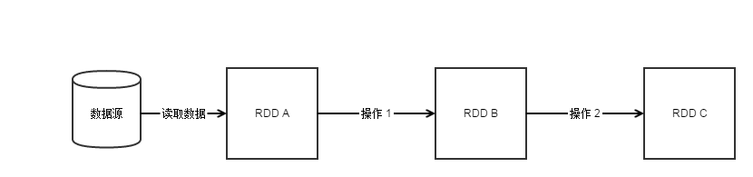

# RDD 概念

Spark 的一切都是建立在RDD这个抽象概念之上，而且也正是因为RDD的设计理念让Spark能比Hadoop更方便的实现兼容各类数据集。学习Spark之前，必须要对RDD有所了解，所以我们下面简单介绍下RDD。

1. ## RDD是什么？
    
    RDD的全称为Resilient Distributed Datasets，是被设计为具有分布式、容错能力的只读数据结构。
2. ## RDD为何是分布式
    
    每个RDD实际是将一个数据集分为了多个分区的小数据集存储在集群的机器上。由于RDD是只读，所以对RDD操作处理都会生成新的RDD，这避免了对同一份数据进行不同更新处理操作带来的问题。

    实际来说，RDD在分布式方面的设计理念并不是新颖而复杂的概念，而就是现今在函数式并行设计的数据只读概念 和 分布式存储概念。
    
3. ## RDD为何具有容错能力

    RDD在设计之时为了解决在Hadoop Map Reduce 中不具有容错机制，引入了依赖（可以理解为“血源”或者“族谱”之类的东东）的概念。
    
    简单来说这个概念就是RDD会保存自身是从那些RDD以及如何从这些RDD生成的记录，当我们计算一个新的RDD时，发现它的RDD源中有一个或者多个RDD由于GC、数据异常丢失等不存在了，但是我们知道这些不能使用的RDD是如何生成的操作记录，我们里面可以重新按照对应操作记录生成RDD。这样就不会像在Hadoop Map Reduce中，我们不得不从头开始重新计算全部数据。
    
    假如我们正常操作如图所示：
    
    
    当假如我们在操作 2 时，发现RDD B 丢失，我们就可以直接从RDD A 进行 操作 1 而生成RDD B，接着我们就可以继续进行操作 2了。
    
4. ## RDD 的两种不同依赖概念

    RDD所引入的依赖概念实际分为两种：窄依赖和宽依赖。
    
    1) 窄依赖 简单来说就是RDD B 只是通过 RDD A 操作而得到，这种一对一的方式就是窄依赖。
    
    2) 宽依赖 简单来说就是RDD E 必须通过 RDD C 和 RDD D进行join等操作处理才能得到，这中一对多的方式就是宽依赖。
    
    为什么要区分这两种依赖方式呢?感觉无非是一个生成一个，多个生成一个而已？
    
    实际区分的原因是分布式计算的设计理念：为了更好计算数据，如果一个节点只计算自身节点上的数据，不用计算时必须从别的节点获取数据，这计算性能将得到极大提升。当然实际应用中，我们是不可能做到这一点的，但是当我们必须做汇总之类的处理时，我们拿到的多个节点的数据是已经每个节点做了自身节点能做的所有处理之后的数据，那么我们汇总所有数据时的量或复杂操作将有一定程度的减小。
    
    回到两个不同的依赖概念上：
    
    A) 窄依赖 由于只是从一个RDD生成另一个RDD，那么我们就可以完全做到一个节点只计算自身节点的数据，数据丢失时我们可以只从自身节点就可以恢复数据了。
    
    B) 宽依赖 无法做到窄依赖那样，所以我们不得不做一些窄依赖没有处理才能生成或恢复RDD。
    
    这就是为什么RDD要重点区分出这两种依赖的原因。
5. ## RDD 存储
    
| 存储级别 | 含义 |
| -- | -- |
| MEMORY_ONLY | 将RDD作为非序列化的Java对象存储在jvm中。如果RDD不适合存在内存中，一些分区将不会被缓存，从而在每次需要这些分区时都需重新计算它们。这是系统默认的存储级别。 |
| MEMORY_AND_DISK | 将RDD作为非序列化的Java对象存储在jvm中。如果RDD不适合存在内存中，将这些不适合存在内存中的分区存储在磁盘中，每次需要时读出它们。 |
| MEMORY_ONLY_SER | 将RDD作为序列化的Java对象存储（每个分区一个byte数组）。这种方式比非序列化方式更节省空间，特别是用到快速的序列化工具时，但是会更耗费cpu资源—密集的读操作。 |
| MEMORY_AND_DISK_SER | 和MEMORY_ONLY_SER类似，但不是在每次需要时重复计算这些不适合存储到内存中的分区，而是将这些分区存储到磁盘中。 |
| DISK_ONLY | 仅仅将RDD分区存储到磁盘中。 |
| MEMORY_ONLY_2, MEMORY_AND_DISK_2, etc. | 和上面的存储级别类似，但是复制每个分区到集群的两个节点上面。 |
| OFF_HEAP (experimental) | 以序列化的格式存储RDD到Tachyon中。相对于MEMORY_ONLY_SER，OFF_HEAP减少了垃圾回收的花费，允许更小的执行者共享内存池。这使其在拥有大量内存的环境下或者多并发应用程序的环境中具有更强的吸引力。 |

### 如何选择存储级别

Spark的多个存储级别意味着在内存利用率和cpu利用效率间的不同权衡。我们推荐通过下面的过程选择一个合适的存储级别：

* 如果你的RDD适合默认的存储级别（MEMORY_ONLY），就选择默认的存储级别。因为这是cpu利用率最高的选项，会使RDD上的操作尽可能的快。

* 如果不适合用默认的级别，选择MEMORY_ONLY_SER。选择一个更快的序列化库提高对象的空间使用率，但是仍能够相当快的访问。

* 除非函数计算RDD的花费较大或者它们需要过滤大量的数据，不要将RDD存储到磁盘上，否则，重复计算一个分区就会和重磁盘上读取数据一样慢。

* 如果你希望更快的错误恢复，可以利用重复(replicated)存储级别。所有的存储级别都可以通过重复计算丢失的数据来支持完整的容错，但是重复的数据能够使你在RDD上继续运行任务，而不需要重复计算丢失的数据。

* 在拥有大量内存的环境中或者多应用程序的环境中，OFF_HEAP具有如下优势：
    
    * 它运行多个执行者共享Tachyon中相同的内存池
    * 它显著地减少垃圾回收的花费
    * 如果单个的执行者崩溃，缓存的数据不会丢失

