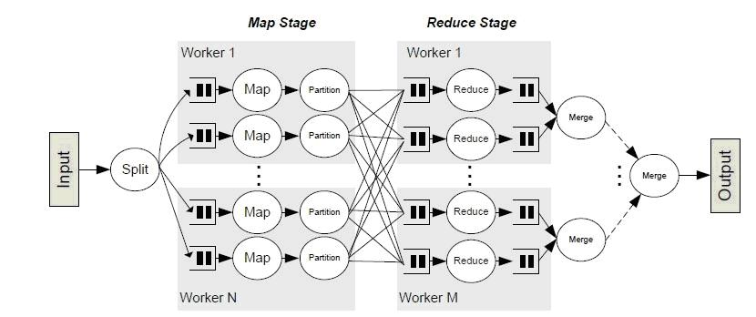

## Shuffle 简单介绍

Shuffle是MapReduce框架中的一个特定的阶段，介于Map阶段和Reduce 阶段之间。当Map的输出结果在被Reduce使用之前，输出结果先按key哈希，然后分发到每一个Reducer上，这个过程就是shuffle。由于shuffle涉及到了磁盘I/O和网络I/O,以及序列化，因此shuffle性能的高低直接影响到了整个程序的运行效率。

下面两幅图中Map阶段和Reduce 阶段之间的复杂处理就是shuffle，也形象地说明了为什么shuffle的性能会影响整个阶段。

