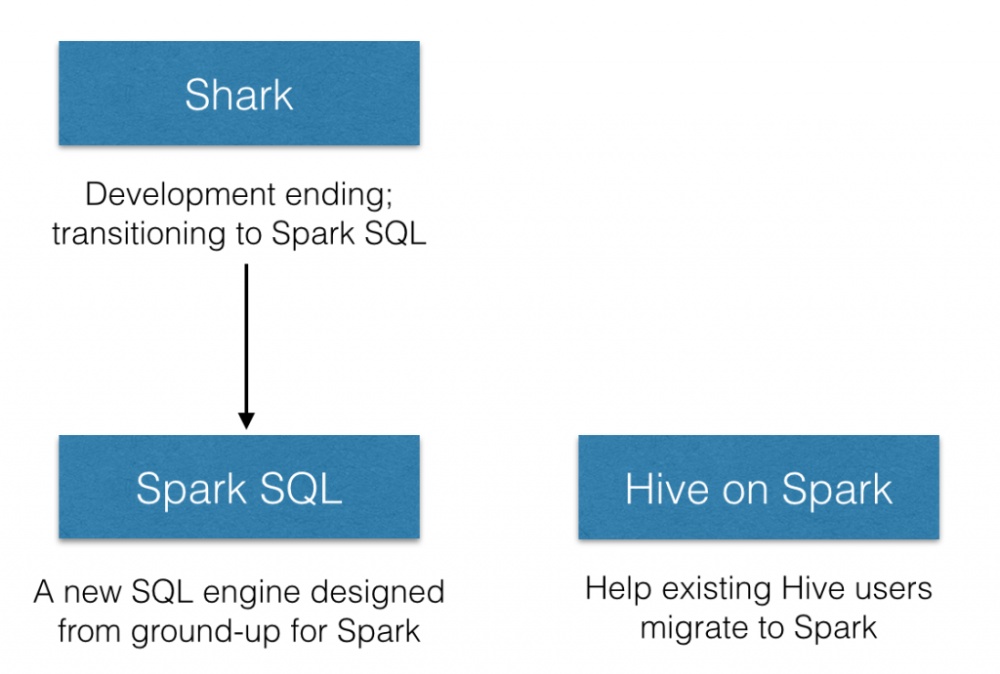

# Spark Sql 介绍

在spark sql 之前，spark团队是以兼容hive为目标而创建了shark，但是由于完全使用hive的东西，导致执行计划无法方便的做优化，并且hive的源码有一些线程安全的问题，所以spark团队不得不放弃的了shark。

spark团队在经历了shark的惨痛教训后，痛下决心，自行实现了名为spark sql 的执行引擎，其仅仅在hive方面hql parser（hive的语法与解析）、Hive Metastore和Hive SerDe，并由Catalyst负责执行计划生成和优化。

Spark Sql 的定位无疑是切合广大开发者，sql语法减少了学习成本，其的优化能力简化了开发者性能调优要求，让开发者不再每句代码都得小心翼翼的。

对hive的支持都移动到了 Hive on Spark中。



个人的观点来说，如果要在spark 上使用sql的方式的话，推荐以spark sql为主，对hive的支持与hive的发展总是有一定差距的,并且 spark 团队可能会调整Hive的支持代码.

spark sql 代码使用入口依然符合spark的习惯 - context的声明：

```Scala
val sc: SparkContext // An existing SparkContext.
val sqlContext = new org.apache.spark.sql.SQLContext(sc)
```

如果要使用hive的支持,入口只需换为 HiveContext,而不使用SQLContext就行.