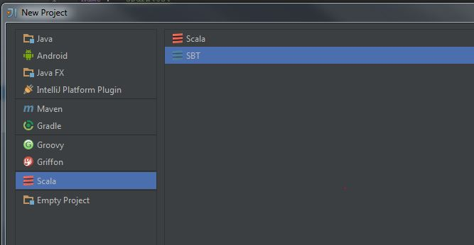
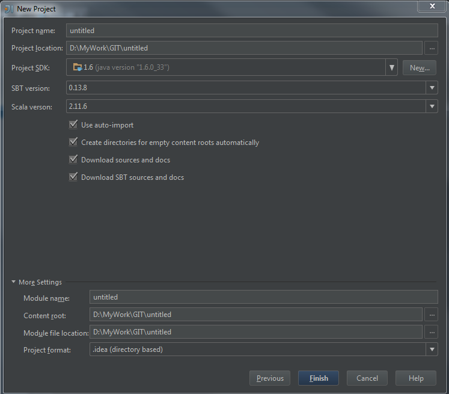
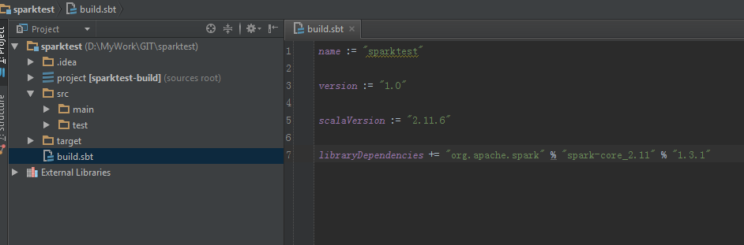

# 搭建开发环境

1. 选择一个IDE

    个人打算使用scala学习spark，scala 常用的IDE有:
    
    1) IntelliJ IDEA : https://www.jetbrains.com/idea/download/
    
    2) scala IDE : http://scala-ide.org/ 

    个人偏向 IntelliJ IDEA的，所以我会使用IntelliJ IDEA 进行教程。
2. 安装 scala
    
    1) 安装 scala ：http://www.scala-lang.org/download/
    
    2）安装 IntelliJ IDEA scala 插件 ：

    File -> Settings -> Plugins -> Install Jet brains plugin -> search scala -> install
    
3. 安装 sbt 
    
    sbt 地址 ：http://www.scala-sbt.org/ 

4. 使用 IntelliJ IDEA 创建一个 sbt 项目
    
    

    
    
    在 build.sbt 加入包依赖
    
    libraryDependencies += "org.apache.spark" % "spark-core_2.11" % "1.3.1"
    
    
    
    然后等待包下载完毕

5. 可以开始coding了
    
    可以使用如下代码测试搭建是否成功

```Scala
    import org.apache.spark._
    
    object testa {
    
      def main(argment: Array[String]): Unit = {
        val conf = new SparkConf().setAppName("test").setMaster("local")
        val sc = new SparkContext(conf)
        val distData = sc.parallelize(1 to 1000)
        println(distData.count())
        sc.stop()
      }
    }
```
    spark 官方教程 ： https://spark.apache.org/docs/latest/programming-guide.html
