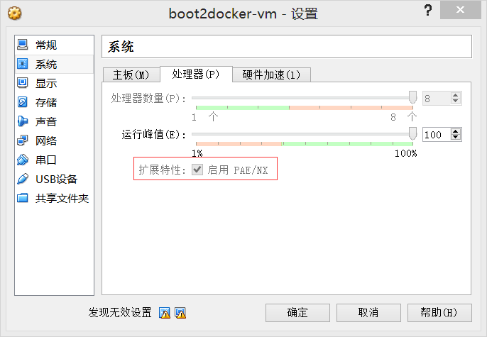

# 安装指南

 一直以来开发者在自己的电脑安装大数据方面工具都面临各种问题。
 
 谁叫我们硬件不一、系统多种、编程语言多样、版本更是森罗万象，工具只能说臣妾不能啊。
 
 好在现在docker出现了，虽说docker是想在云中称王称霸，但是镜像的做法无疑在各个方面方便尝试大数据工具的小伙伴们了。我们可以不担心为了尝试一个工具而装了一堆可能一辈子不用的东西、不得不java等语言版本啊之类的问题。
 
 所以在小吹了一下docker之后，我们的安装指南将毫无疑问地介绍如何利用docker使用spark。
 
 1. 安装docker

    这个地址有各个系统的docker安装指南： https://docs.docker.com/installation/#installation     
    我使用的是window，所以简单的执行 docker-install.exe 就可以装好。
    
    一个坑：我装好后，virtual box 的 docker 镜像默认设置是使用 Intel VT-x，我电脑是不支持这个的，得在virtual box 的 docker 镜像设置中启用图中设置才能启动docker
    
    
    
 2. 安装spark docker 镜像
    
    1) docker pull sequenceiq/spark:1.3.1
    
    2) docker build --rm -t sequenceiq/spark:1.3.1
    
    3)    

    参考 https://github.com/sequenceiq/docker-spark 
    
    可以国内网络问题，没有用vpn的话，失败率极高, 我是搞了整整一天